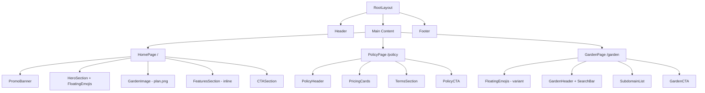

# Design Document: khoai-to-clone

## Overview

Dự án clone lại giao diện trang web khoai.to thành ứng dụng Next.js 16 với App Router. Đây là static site (không cần backend thực), tập trung vào UI/UX với animations mượt mà, responsive design, và nội dung tiếng Việt.

### Phạm vi thay đổi so với codebase hiện tại

| Thành phần | Hành động | Mô tả |
|---|---|---|
| Header | Sửa nhỏ | Đổi link "Vườn khoai" trỏ `/garden` thay vì `/#garden` |
| PromoBanner | Sửa lớn | Đổi countdown sang DD:HH:MM, thêm tiêu đề "Vườn khoai mở bán", thêm nút CTA |
| Hero Section | Sửa nhỏ | Đổi badge text, đổi link nút "Xem tính năng" thành anchor `#features` |
| GardenCanvas | Xóa | Thay bằng hình ảnh tĩnh `plan.png` |
| Features Section | Di chuyển | Từ trang `/features` → inline trên trang chủ |
| CTA Section | Sửa nhỏ | Đổi text nút thành "Bắt đầu miễn phí" |
| Footer | Sửa | Bỏ GitHub icon, đổi links, đổi copyright |
| Trang `/policy` | Redesign | Pricing cards + điều khoản 6 mục |
| Trang `/garden` | Mới | Danh sách subdomain + tìm kiếm |
| Trang `/features` | Xóa | Nội dung merge vào trang chủ |

## Architecture

### Route Structure (App Router)

```
src/app/
├── layout.tsx          # Root layout (Header + Footer)
├── page.tsx            # Trang chủ (/, gồm: PromoBanner, Hero, Image, Features, CTA)
├── globals.css         # Tailwind imports
├── custom.css          # Custom CSS (giữ nguyên + thêm styles mới)
├── favicon.ico
├── policy/
│   └── page.tsx        # Trang chính sách (pricing cards + terms)
├── garden/
│   └── page.tsx        # Trang vườn khoai (danh sách subdomain + search)
└── features/           # XÓA thư mục này
```

### Component Tree



### Rendering Strategy

- **Server Components** (mặc định): `page.tsx` cho tất cả routes, `Footer`, `FeaturesSection`, `CTASection`, `PolicyPage`, phần static của `GardenPage`
- **Client Components** (`"use client"`): `Header` (scroll listener), `PromoBanner` (countdown timer), `FloatingEmojis` (DOM manipulation), `GardenSearch` (search state), `GardenPage` (filter state)

## Components and Interfaces

### 1. Header (sửa nhỏ)

**File:** `src/components/layout/Header.tsx`

**Thay đổi:**
- Link "Vườn khoai" đổi `href` từ `/#garden` → `/garden`
- Giữ nguyên logic scroll, mobile menu

```typescript
// Navigation links
const navLinks = [
  { href: "#features", label: "🌿 Tính năng" },
  { href: "/policy", label: "📋 Chính sách" },
  { href: "/garden", label: "🌾 Vườn khoai" },
];
```

### 2. PromoBanner (sửa lớn)

**File:** `src/components/PromoBanner.tsx`

**Thay đổi chính:**
- Thêm tiêu đề "Vườn khoai mở bán" 
- Countdown đổi sang format DD:HH:MM (đếm ngược đến ngày target cố định)
- Thêm nút CTA "Đăng nhập để nhận ngay"
- Giữ progress bar "87/100 slots còn lại"

```typescript
interface CountdownState {
  days: number;
  hours: number;
  minutes: number;
}

// Target date: cố định 1 ngày trong tương lai (mock)
const TARGET_DATE = new Date("2025-08-01T00:00:00");
```

**Logic countdown:**
- Tính khoảng cách từ `now` đến `TARGET_DATE`
- Hiển thị DD:HH:MM
- Cập nhật mỗi giây (interval 1000ms)
- Khi hết hạn: hiển thị "00:00:00"

### 3. Hero Section (sửa nhỏ)

**File:** `src/app/page.tsx` (inline trong trang chủ)

**Thay đổi:**
- Badge text: "Subdomain miễn phí · DNS trong vài giây 🌱"
- Nút "Xem tính năng" đổi `href` từ `/features` → `#features` (anchor scroll)
- Giữ nguyên FloatingEmojis, heading, subtitle

### 4. Garden Image (thay GardenCanvas)

**File:** `src/app/page.tsx` (inline)

**Thay đổi:**
- Xóa import `GardenCanvas`
- Thay bằng `<Image>` component hiển thị `/plan.png`
- Styling: border-radius 20px, box-shadow, responsive width
- Fallback: div với background gradient xanh nếu ảnh lỗi

```typescript
import Image from "next/image";

// Trong JSX:
<section className="garden-image-section">
  <div className="container">
    <div className="garden-image-wrapper">
      <Image
        src="/plan.png"
        alt="Vườn khoai - Kế hoạch phát triển"
        width={1100}
        height={400}
        className="garden-image"
        priority
      />
    </div>
  </div>
</section>
```

### 5. Features Section (di chuyển vào trang chủ)

**File:** `src/app/page.tsx` (inline)

**Thay đổi:**
- Copy nội dung từ `src/app/features/page.tsx` vào trang chủ
- Thêm `id="features"` để anchor link hoạt động
- Bỏ `pt-[120px]` (không cần padding top vì không còn là trang riêng)
- Giữ nguyên 4 cards với nội dung và màu sắc

### 6. CTA Section (sửa nhỏ)

**File:** `src/app/page.tsx` (inline)

**Thay đổi:**
- Nút text đổi từ "🌱 Đăng nhập với Google" → "🌱 Bắt đầu miễn phí"
- Giữ nguyên heading, description, tags, styling

### 7. Footer (đơn giản hóa)

**File:** `src/components/layout/Footer.tsx`

**Thay đổi:**
- Bỏ GitHub icon (chỉ giữ Facebook + Telegram)
- Đổi copyright: "© 2025 khoai.to"
- Links "Sản phẩm": Tính năng → `/#features`, Chính sách → `/policy`, Vườn khoai → `/garden`
- Bỏ phần "Tài khoản" links hoặc giữ với `href="#"`

### 8. Trang Policy (redesign hoàn toàn)

**File:** `src/app/policy/page.tsx`

**Cấu trúc mới:**

```typescript
export default function PolicyPage() {
  return (
    <>
      {/* Header section */}
      <section className="policy-header">
        <h1>Cách trồng khoai.</h1>
        <p>Để có một vườn khoai to tươi tốt. 🌱</p>
      </section>

      {/* Pricing Cards */}
      <section className="pricing-section">
        <PricingCard 
          title="Chiến dịch khuyến mãi"
          price="0đ"
          features={[...]}
          cta="Đăng nhập để nhận"
        />
        <PricingCard 
          title="Gói thêm"
          price="Liên hệ"
          features={[...]}
          cta="Liên hệ admin"
        />
      </section>

      {/* Terms Section - 6 mục */}
      <section className="terms-section">
        <TermItem title="Sử dụng hợp lệ" content="..." />
        <TermItem title="Bảo mật tài khoản" content="..." />
        <TermItem title="Tính sẵn sàng" content="..." />
        <TermItem title="Thu hồi & Chấm dứt" content="..." />
        <TermItem title="Dữ liệu cá nhân" content="..." />
        <TermItem title="Liên hệ & Hỗ trợ" content="..." />
      </section>

      {/* CTA */}
      <section className="policy-cta">
        <p>Cần nhiều subdomain hơn?</p>
        <a href="mailto:admin@khoai.to">admin@khoai.to</a>
      </section>
    </>
  );
}
```

### 9. Trang Garden (mới hoàn toàn)

**File:** `src/app/garden/page.tsx`

**Cấu trúc:**

```typescript
"use client";

import { useState } from "react";
import FloatingEmojis from "@/components/FloatingEmojis";

export default function GardenPage() {
  const [searchQuery, setSearchQuery] = useState("");
  
  const filteredSubdomains = MOCK_SUBDOMAINS.filter(item =>
    item.subdomain.toLowerCase().includes(searchQuery.toLowerCase()) ||
    item.owner.toLowerCase().includes(searchQuery.toLowerCase())
  );

  return (
    <>
      <FloatingEmojis emojis={["🦋", "🐝", "🌸", "✨"]} />
      
      {/* Header + Search */}
      <section className="garden-header">
        <h1>🌾 Vườn khoai cộng đồng</h1>
        <p>Danh sách subdomain công khai</p>
        <input 
          type="text"
          placeholder="Tìm kiếm subdomain..."
          value={searchQuery}
          onChange={(e) => setSearchQuery(e.target.value)}
        />
      </section>

      {/* Subdomain List */}
      <section className="garden-list">
        {filteredSubdomains.map(item => (
          <SubdomainCard key={item.id} {...item} />
        ))}
      </section>

      {/* CTA */}
      <section className="garden-cta">
        <p>Muốn chia sẻ subdomain của bạn?</p>
        <a href="#">Đi đến Dashboard →</a>
      </section>
    </>
  );
}
```

### 10. FloatingEmojis (mở rộng)

**File:** `src/components/FloatingEmojis.tsx`

**Thay đổi:**
- Thêm prop `emojis?: string[]` để cho phép custom bộ emoji
- Default: `["🥔", "🌿", "🌱", "🍠", "🌾", "☘️", "🍃", "💧", "🌻", "🐛"]`
- Garden page dùng: `["🦋", "🐝", "🌸", "✨"]`

```typescript
interface FloatingEmojisProps {
  emojis?: string[];
}

export default function FloatingEmojis({ 
  emojis = ["🥔", "🌿", "🌱", "🍠", "🌾", "☘️", "🍃", "💧", "🌻", "🐛"] 
}: FloatingEmojisProps) {
  // ... logic giữ nguyên, dùng prop emojis thay hardcoded array
}
```

## Data Models

### SubdomainItem (Mock data cho Garden page)

```typescript
interface SubdomainItem {
  id: string;
  subdomain: string;      // e.g. "blog.khoai.to"
  url: string;            // full URL
  owner: string;          // tên người dùng
  createdAt: string;      // ISO date string, e.g. "2025-01-15"
}
```

### Mock Data

```typescript
const MOCK_SUBDOMAINS: SubdomainItem[] = [
  {
    id: "1",
    subdomain: "blog.khoai.to",
    url: "https://blog.khoai.to",
    owner: "Minh Trần",
    createdAt: "2025-01-15",
  },
  {
    id: "2",
    subdomain: "portfolio.khoai.to",
    url: "https://portfolio.khoai.to",
    owner: "Lan Nguyễn",
    createdAt: "2025-02-03",
  },
  {
    id: "3",
    subdomain: "api.khoai.to",
    url: "https://api.khoai.to",
    owner: "Hùng Lê",
    createdAt: "2025-02-20",
  },
  {
    id: "4",
    subdomain: "shop.khoai.to",
    url: "https://shop.khoai.to",
    owner: "Thảo Phạm",
    createdAt: "2025-03-01",
  },
  {
    id: "5",
    subdomain: "docs.khoai.to",
    url: "https://docs.khoai.to",
    owner: "Đức Võ",
    createdAt: "2025-03-10",
  },
  {
    id: "6",
    subdomain: "game.khoai.to",
    url: "https://game.khoai.to",
    owner: "Khoa Hoàng",
    createdAt: "2025-03-22",
  },
];
```

### PricingFeature (cho Policy page)

```typescript
interface PricingFeature {
  text: string;
  included: boolean;
}

interface PricingCard {
  title: string;
  price: string;
  period?: string;
  features: PricingFeature[];
  ctaText: string;
  ctaHref: string;
  highlighted?: boolean;
}
```

### TermItem (cho Policy page)

```typescript
interface TermItem {
  icon: string;
  title: string;
  content: string;
}
```

## Error Handling

### Hình ảnh plan.png không tải được
- Sử dụng Next.js `<Image>` với `onError` callback
- Fallback: hiển thị div với background gradient xanh và text "🌱 Vườn khoai"
- Không crash app, graceful degradation

### Countdown hết hạn
- Khi `TARGET_DATE` đã qua: hiển thị "00:00:00"
- Không ẩn banner, vẫn hiển thị với countdown = 0

### Search không có kết quả (Garden page)
- Hiển thị message "Không tìm thấy subdomain nào phù hợp"
- Giữ search input active để user có thể sửa query

### Hydration mismatch (Client components)
- PromoBanner: dùng `mounted` state để tránh SSR/client mismatch cho countdown
- FloatingEmojis: chỉ tạo DOM elements sau khi mount (useEffect)

## Testing Strategy

### Tại sao không dùng Property-Based Testing

Feature này chủ yếu là UI rendering, layout, và animations. Không có pure functions phức tạp với input space lớn cần kiểm tra. Cụ thể:
- Phần lớn code là JSX rendering (UI) → dùng snapshot tests
- Countdown logic là tính toán thời gian đơn giản → example-based tests
- Search filter là string matching cơ bản → example-based tests
- Animations/effects là CSS → visual regression tests

### Unit Tests (Example-based)

1. **Countdown logic**: Test tính toán DD:HH:MM từ date difference
   - Input: target date cụ thể, current date cụ thể
   - Expected: đúng số ngày, giờ, phút
   - Edge case: target đã qua → trả về 0:0:0

2. **Search filter (Garden page)**: Test lọc subdomain
   - Input: query "blog", mock data
   - Expected: chỉ trả về items có "blog" trong subdomain hoặc owner
   - Edge case: query rỗng → trả về tất cả
   - Edge case: query không match → trả về mảng rỗng

3. **FloatingEmojis props**: Test component nhận custom emojis
   - Default emojis khi không truyền prop
   - Custom emojis khi truyền prop

### Component Tests

1. **Header**: Verify render đúng links, scroll behavior thêm class
2. **PromoBanner**: Verify countdown hiển thị, progress bar
3. **PolicyPage**: Verify 2 pricing cards, 6 terms items render
4. **GardenPage**: Verify search input, subdomain list render

### Visual/Manual Tests

1. Responsive breakpoints: 768px, 480px
2. Animations: shimmer, fadeInUp, hover effects
3. Font rendering: Inter Vietnamese subset
4. Image fallback khi plan.png không có

### Test Framework

- Sử dụng testing framework có sẵn trong Next.js ecosystem
- Component tests với React Testing Library
- Không cần E2E tests cho static site này

## CSS/Styling Approach

### Giữ nguyên
- `src/app/custom.css` — toàn bộ CSS hiện tại (header, promo, hero, features, CTA, footer, animations, responsive)
- `src/app/globals.css` — Tailwind imports
- CSS variables trong `:root`

### Thêm mới (append vào custom.css)

```css
/* ===== GARDEN IMAGE SECTION ===== */
.garden-image-section { ... }
.garden-image-wrapper { ... }
.garden-image { ... }

/* ===== POLICY PAGE ===== */
.policy-header { ... }
.pricing-section { ... }
.pricing-card { ... }
.terms-section { ... }
.term-item { ... }
.policy-cta { ... }

/* ===== GARDEN PAGE ===== */
.garden-header { ... }
.garden-search { ... }
.garden-list { ... }
.subdomain-card { ... }
.garden-cta { ... }
```

### Styling Principles
- Tiếp tục dùng CSS custom properties (variables) đã định nghĩa
- Dùng cùng color palette: `--forest-green`, `--emerald`, `--golden`, `--bg-primary`
- Dùng cùng shadow/transition variables
- Card styles mới follow pattern của `.feature-card` (border-radius 20px, hover translateY)
- Responsive: mobile-first, breakpoints 768px và 480px

## Files cần xóa

| File | Lý do |
|---|---|
| `src/components/GardenCanvas.tsx` | Thay bằng hình ảnh tĩnh |
| `src/app/features/page.tsx` | Nội dung merge vào trang chủ |
| `src/app/features/` (thư mục) | Không còn route `/features` |

## Files cần tạo mới

| File | Mô tả |
|---|---|
| `src/app/garden/page.tsx` | Trang vườn khoai mới |
| `public/plan.png` | Hình ảnh vườn khoai (cần user cung cấp) |
| `src/data/mock-subdomains.ts` | Mock data cho garden page |

## Quyết định thiết kế

1. **Không tách components nhỏ cho Policy page** — Vì pricing cards và terms items đơn giản, render inline trong page.tsx là đủ. Tránh over-engineering.

2. **GardenPage là Client Component** — Cần state cho search filter. Toàn bộ page dùng `"use client"` vì search interaction là core feature.

3. **Mock data tách file riêng** — `src/data/mock-subdomains.ts` để dễ thay thế bằng API call sau này.

4. **FloatingEmojis nhận prop** — Thay vì tạo component mới, mở rộng component hiện tại với prop `emojis` để reuse.

5. **Countdown target date cố định** — Dùng hardcoded date thay vì tính từ end-of-day. Phù hợp với yêu cầu "Vườn khoai mở bán" (event cụ thể).

6. **Giữ custom.css thay vì migrate sang Tailwind** — Codebase hiện tại dùng custom CSS heavily. Migrate sang pure Tailwind sẽ tốn effort lớn và không cần thiết cho clone project.
